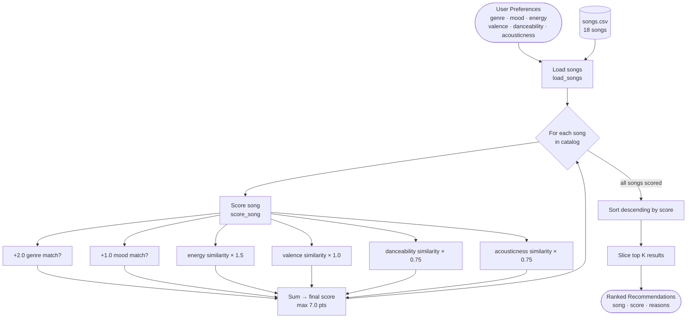

# 🎵 Music Recommender Simulation

## Project Summary

In this project you will build and explain a small music recommender system.

Your goal is to:

- Represent songs and a user "taste profile" as data
- Design a scoring rule that turns that data into recommendations
- Evaluate what your system gets right and wrong
- Reflect on how this mirrors real world AI recommenders

Replace this paragraph with your own summary of what your version does.

---

## Data Flow



## How The System Works

This is a content-based recommender — no other users needed. Every song in the catalog is scored against the user's taste profile, then the top K scores are returned as recommendations. The approach is fully transparent: every point in a song's score can be traced back to a specific feature match.

### Algorithm Recipe

Scoring happens in two layers for each song:

**Step 1 — Categorical matches (binary, all-or-nothing)**

| Rule | Points |
|---|---|
| Song's genre matches user's preferred genre | +2.0 |
| Song's mood matches user's preferred mood | +1.0 |

**Step 2 — Numeric proximity (how close is close enough?)**

For each numeric feature the formula is:

```
proximity = 1 - |song_value - user_target|
```

A perfect match scores 1.0; the further apart the values, the closer to 0.0. Each proximity is then multiplied by its weight:

| Feature | Weight | Why this weight |
|---|---|---|
| energy | ×1.5 | Biggest driver of how a song feels — intensity matters most |
| valence | ×1.0 | Emotional tone (bright vs. dark) |
| danceability | ×0.75 | Groove feel, supporting signal |
| acousticness | ×0.75 | Organic vs. electronic texture |

**Max possible score: 7.0 points** (2.0 + 1.0 + 1.5 + 1.0 + 0.75 + 0.75)

**Step 3 — Ranking**

After every song is scored, the list is sorted in descending order and the top K results are returned. Without this step a score is just a number — ranking is what turns individual scores into a recommendation list.

---

### Known Biases and Limitations

- **Genre dominance.** At +2.0 points, a genre match is worth more than any single numeric feature. A perfect-vibe song in a slightly different genre (e.g., indie pop vs. pop) will almost always lose to a mediocre same-genre song. This can create a "genre bubble" where the user never discovers adjacent styles they might enjoy.

- **Mood is binary.** "Chill" either matches or it doesn't — there's no partial credit for a song that's close in feel but labeled differently. Two songs with nearly identical energy and valence can score very differently just because of how their mood tag was assigned.

- **Small catalog amplifies bias.** With only 18 songs, some genres and moods appear only once. A user who prefers "jazz" or "funk" will always get the same top result regardless of how well the numeric features align.

- **No diversity enforcement.** The ranker always picks the closest matches, so results can cluster around one or two artists or sub-genres. A real recommender would inject some variety to avoid a monotonous list.

- **Tempo is ignored.** `tempo_bpm` is loaded but not scored. A 168 BPM metal track and a 72 BPM lofi track could score identically if their other features happen to align.

## Sample Output

Running `python -m src.main` produces results for six profiles — three standard and three adversarial edge cases.

### Profile 1: High-Energy Pop

```
══════════════════════════════════════════════════════
  🎵  Profile 1: High-Energy Pop
  genre=pop  mood=happy  energy=0.85
──────────────────────────────────────────────────────
  #1  Sunrise City  —  Neon Echo
       Score : 6.92 / 7.00
       Why   : genre match, mood match, close energy, close valence, close danceability, close acousticness

  #2  Gym Hero  —  Max Pulse
       Score : 5.67 / 7.00
       Why   : genre match, close energy, close valence, close danceability, close acousticness

  #3  Rooftop Lights  —  Indigo Parade
       Score : 4.66 / 7.00
       Why   : mood match, close energy, close valence, close danceability

  #4  Neon Horizon  —  Pulse Array
       Score : 3.74 / 7.00
       Why   : close energy, close valence, close danceability, close acousticness

  #5  Groove Architect  —  Funky Dimension
       Score : 3.73 / 7.00
       Why   : close energy, close valence, close danceability, close acousticness
══════════════════════════════════════════════════════
```

Sunrise City nails every signal (6.92/7.00). Gym Hero loses the mood bonus (+1.0) because it's tagged "intense" not "happy", dropping it to 5.67.

---

### Profile 2: Chill Lofi

```
══════════════════════════════════════════════════════
  ☁️   Profile 2: Chill Lofi
  genre=lofi  mood=chill  energy=0.4
──────────────────────────────────────────────────────
  #1  Midnight Coding  —  LoRoom
       Score : 6.88 / 7.00
       Why   : genre match, mood match, close energy, close valence, close danceability, close acousticness

  #2  Library Rain  —  Paper Lanterns
       Score : 6.83 / 7.00
       Why   : genre match, mood match, close energy, close valence, close danceability, close acousticness

  #3  Focus Flow  —  LoRoom
       Score : 5.97 / 7.00
       Why   : genre match, close energy, close valence, close danceability, close acousticness

  #4  Spacewalk Thoughts  —  Orbit Bloom
       Score : 4.50 / 7.00
       Why   : mood match, close energy, close valence

  #5  Coffee Shop Stories  —  Slow Stereo
       Score : 3.70 / 7.00
       Why   : close energy, close valence, close danceability, close acousticness
══════════════════════════════════════════════════════
```

The three lofi tracks dominate. Spacewalk Thoughts (ambient/chill) sneaks in at #4 on mood match alone — a cross-genre recommendation that actually makes sense.

---

### Profile 3: Deep Intense Rock

```
══════════════════════════════════════════════════════
  🤘  Profile 3: Deep Intense Rock
  genre=rock  mood=intense  energy=0.92
──────────────────────────────────────────────────────
  #1  Storm Runner  —  Voltline
       Score : 6.76 / 7.00
       Why   : genre match, mood match, close energy, close valence, close danceability, close acousticness

  #2  Gym Hero  —  Max Pulse
       Score : 4.29 / 7.00
       Why   : mood match, close energy, close acousticness

  #3  Shatter the Crown  —  Iron Veil
       Score : 3.83 / 7.00
       Why   : close energy, close valence, close danceability, close acousticness

  #4  Night Drive Loop  —  Neon Echo
       Score : 3.36 / 7.00
       Why   : close valence, close acousticness

  #5  Concrete Jungle  —  Asphalt Kings
       Score : 3.35 / 7.00
       Why   : close energy, close acousticness
══════════════════════════════════════════════════════
```

Only one rock song in the catalog so #1 is a lock. The gap between #1 (6.76) and #2 (4.29) shows how much the genre bonus matters.

---

### Edge Case 1: High Energy + Conflicting Mood

```
══════════════════════════════════════════════════════
  ⚡  Edge Case 1: High Energy + Sad Mood (conflicting signals)
  genre=classical  mood=melancholic  energy=0.9
──────────────────────────────────────────────────────
  #1  Moonlit Sonata  —  Clara Voss
       Score : 5.81 / 7.00
       Why   : genre match, mood match, close valence, close danceability, close acousticness

  #2  Shatter the Crown  —  Iron Veil
       Score : 2.94 / 7.00
       Why   : close energy, close valence

  #3  Storm Runner  —  Voltline
       Score : 2.80 / 7.00
       Why   : close energy

  #4  Night Drive Loop  —  Neon Echo
       Score : 2.62 / 7.00
       Why   : close energy

  #5  Spacewalk Thoughts  —  Orbit Bloom
       Score : 2.52 / 7.00
       Why   : close danceability, close acousticness
══════════════════════════════════════════════════════
```

Interesting result: Moonlit Sonata wins despite having energy=0.22 (vs. target 0.90) because the genre+mood categorical bonus (3.0 pts) overwhelms the energy penalty. The system is "tricked" — it recommends a very quiet classical piece to someone who asked for high energy. This confirms the genre dominance bias noted in the README.

---

### Edge Case 2: Genre Ghost (no catalog match)

```
══════════════════════════════════════════════════════
  👻  Edge Case 2: Genre ghost (no matching genre in catalog)
  genre=ambient  mood=angry  energy=0.95
──────────────────────────────────────────────────────
  #1  Shatter the Crown  —  Iron Veil
       Score : 4.51 / 7.00
       Why   : mood match, close energy, close acousticness

  #2  Spacewalk Thoughts  —  Orbit Bloom
       Score : 3.43 / 7.00
       Why   : genre match

  #3  Storm Runner  —  Voltline
       Score : 3.34 / 7.00
       Why   : close energy, close acousticness

  #4  Concrete Jungle  —  Asphalt Kings
       Score : 3.30 / 7.00
       Why   : close energy, close danceability, close acousticness

  #5  Gym Hero  —  Max Pulse
       Score : 3.29 / 7.00
       Why   : close energy, close danceability, close acousticness
══════════════════════════════════════════════════════
```

The mood "angry" only exists on Shatter the Crown, so it wins on mood match + energy proximity. Spacewalk Thoughts (the only ambient song) ranks #2 purely on genre match despite being the polar opposite in energy — another example of categorical weight overriding numeric fit.

---

### Edge Case 3: All-Middle Preferences (no strong signal)

```
══════════════════════════════════════════════════════
  🎭  Edge Case 3: All-middle preferences (no strong signal)
  genre=reggae  mood=nostalgic  energy=0.5
──────────────────────────────────────────────────────
  #1  Dusty Backroads  —  The Hollow Pines
       Score : 4.39 / 7.00
       Why   : mood match, close energy, close danceability

  #2  Midnight Coding  —  LoRoom
       Score : 3.57 / 7.00
       Why   : close energy, close valence, close danceability

  #3  Focus Flow  —  LoRoom
       Score : 3.48 / 7.00
       Why   : close energy, close valence, close danceability

  #4  Velvet Midnight  —  Sable June
       Score : 3.43 / 7.00
       Why   : close energy, close acousticness

  #5  Library Rain  —  Paper Lanterns
       Score : 3.34 / 7.00
       Why   : close energy, close valence, close danceability
══════════════════════════════════════════════════════
```

With no genre match possible (reggae isn't in the catalog) and only one mood match, the ranking becomes a pure numeric proximity race. Scores cluster tightly between 3.34–4.39, showing the system has low confidence — all results feel equally mediocre.

---

## Getting Started

### Setup

1. Create a virtual environment (optional but recommended):

   ```bash
   python -m venv .venv
   source .venv/bin/activate      # Mac or Linux
   .venv\Scripts\activate         # Windows

2. Install dependencies

```bash
pip install -r requirements.txt
```

3. Run the app:

```bash
python -m src.main
```

### Running Tests

Run the starter tests with:

```bash
pytest
```

You can add more tests in `tests/test_recommender.py`.

---

## Experiments You Tried

Use this section to document the experiments you ran. For example:

- What happened when you changed the weight on genre from 2.0 to 0.5
- What happened when you added tempo or valence to the score
- How did your system behave for different types of users

---

## Limitations and Risks

Summarize some limitations of your recommender.

Examples:

- It only works on a tiny catalog
- It does not understand lyrics or language
- It might over favor one genre or mood

You will go deeper on this in your model card.

---

## Reflection

Read and complete `model_card.md`:

[**Model Card**](model_card.md)

Write 1 to 2 paragraphs here about what you learned:

- about how recommenders turn data into predictions
- about where bias or unfairness could show up in systems like this


---

## 7. `model_card_template.md`

Combines reflection and model card framing from the Module 3 guidance. :contentReference[oaicite:2]{index=2}  

```markdown
# 🎧 Model Card - Music Recommender Simulation

## 1. Model Name

Give your recommender a name, for example:

> VibeFinder 1.0

---

## 2. Intended Use

- What is this system trying to do
- Who is it for

Example:

> This model suggests 3 to 5 songs from a small catalog based on a user's preferred genre, mood, and energy level. It is for classroom exploration only, not for real users.

---

## 3. How It Works (Short Explanation)

Describe your scoring logic in plain language.

- What features of each song does it consider
- What information about the user does it use
- How does it turn those into a number

Try to avoid code in this section, treat it like an explanation to a non programmer.

---

## 4. Data

Describe your dataset.

- How many songs are in `data/songs.csv`
- Did you add or remove any songs
- What kinds of genres or moods are represented
- Whose taste does this data mostly reflect

---

## 5. Strengths

Where does your recommender work well

You can think about:
- Situations where the top results "felt right"
- Particular user profiles it served well
- Simplicity or transparency benefits

---

## 6. Limitations and Bias

Where does your recommender struggle

Some prompts:
- Does it ignore some genres or moods
- Does it treat all users as if they have the same taste shape
- Is it biased toward high energy or one genre by default
- How could this be unfair if used in a real product

---

## 7. Evaluation

How did you check your system

Examples:
- You tried multiple user profiles and wrote down whether the results matched your expectations
- You compared your simulation to what a real app like Spotify or YouTube tends to recommend
- You wrote tests for your scoring logic

You do not need a numeric metric, but if you used one, explain what it measures.

---

## 8. Future Work

If you had more time, how would you improve this recommender

Examples:

- Add support for multiple users and "group vibe" recommendations
- Balance diversity of songs instead of always picking the closest match
- Use more features, like tempo ranges or lyric themes

---

## 9. Personal Reflection

A few sentences about what you learned:

- What surprised you about how your system behaved
- How did building this change how you think about real music recommenders
- Where do you think human judgment still matters, even if the model seems "smart"

